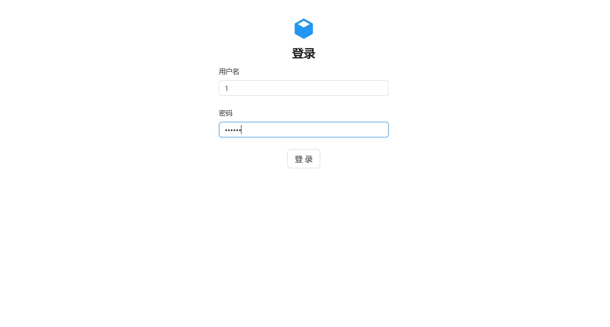
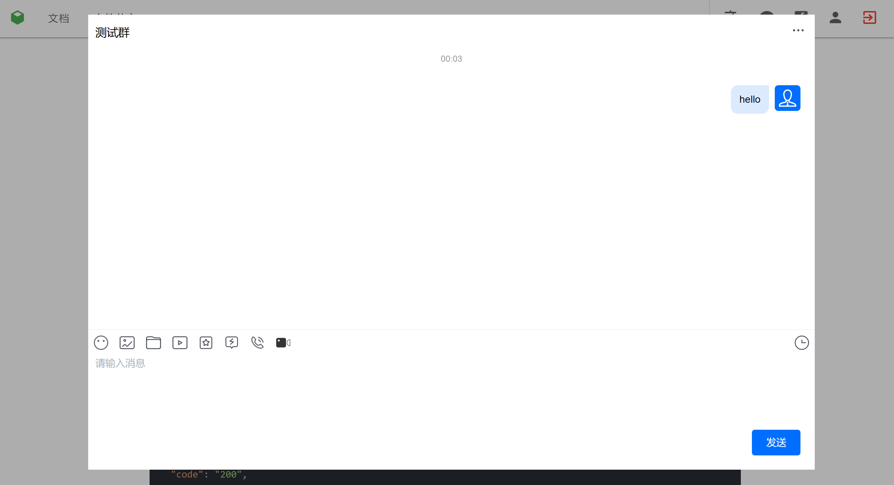
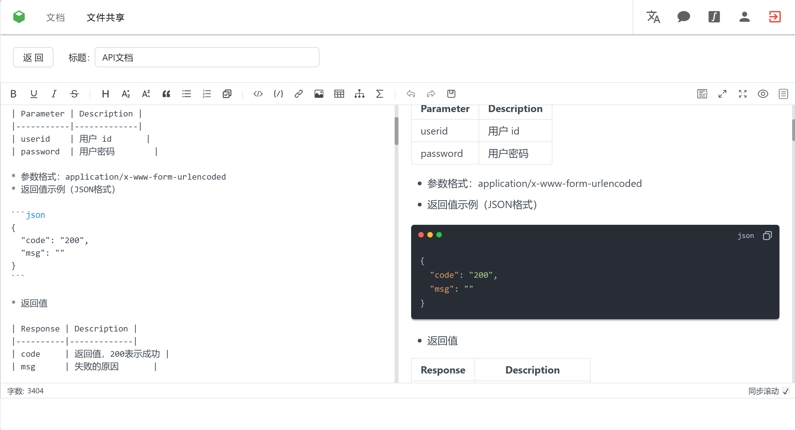
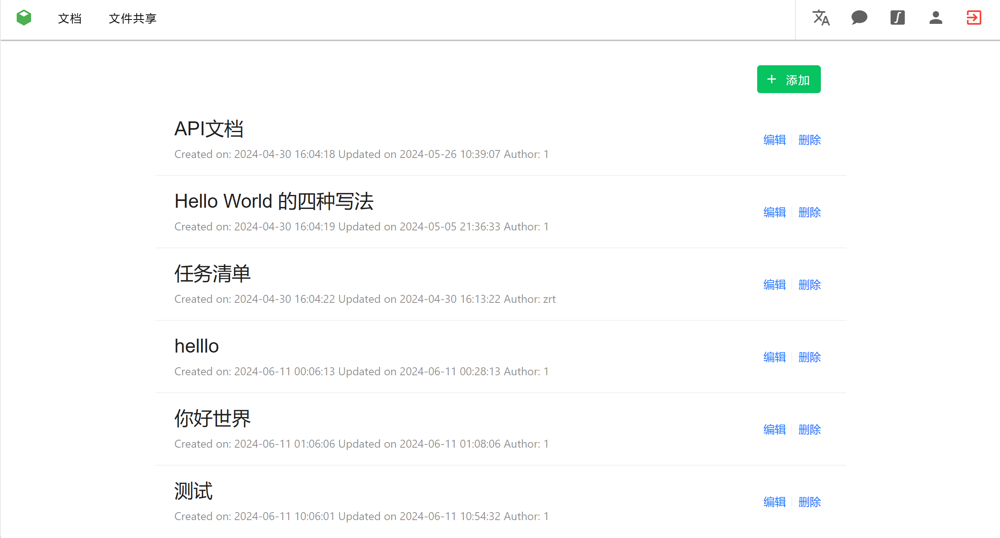
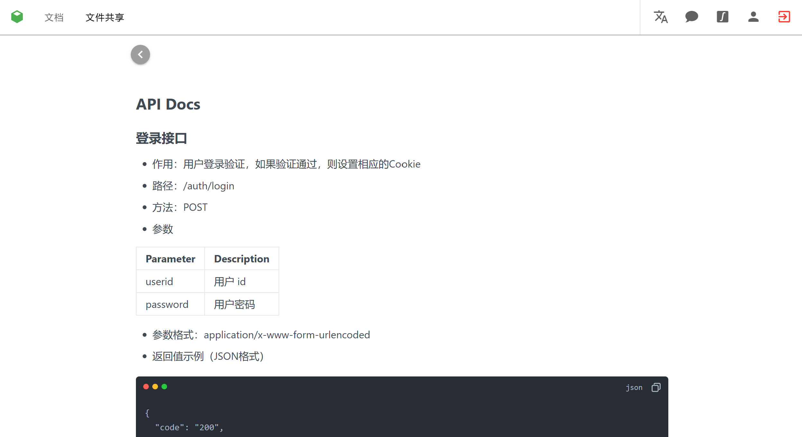
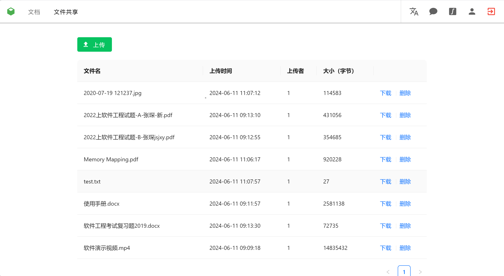

# Open Collaboration

## Introduction

Open Collaboration(协创云 in Chinese) is a web platform that supports online communication, Markdown editing & reading,
translation and
file storage.

This is the group project for Software Engineering(软件工程) of Xidian University(Spring 2024).

Our group includes Ruitian Zhong,Haoran Xu, Jiahao Li and Wenzhuo Li.

To deploy the server and front end, see the following sections.

If you have any problem, feel free to contact me!

## Preview

Homepage

Login

Chat

Markdown editing

Docs list

Docs Preview

Files list


## Project setup

### Front end

Install the dependencies for front end page.

```
# yarn
yarn

# npm
npm install

# pnpm
pnpm install

# bun
bun install
```

Compiles and hot-reloads for development

```
# yarn
yarn dev

# npm
npm run dev

# pnpm
pnpm dev

# bun
bun run dev
```

Lints and fixes files

```
# yarn
yarn lint

# npm
npm run lint

# pnpm
pnpm lint

# bun
bun run lint
```

### Server

+ Download [Go](https://go.dev/dl/) on your machine.

+ If you have network problem,configure the GOPROXY:

```shell
go env -w GOPROXY=https://mirrors.aliyun.com/goproxy/,direct
```

## Build

### Front end

```
# yarn
yarn build

# npm
npm run build

# pnpm
pnpm build

# bun
bun run build
```

### Back end

```shell
cd server
go build server
nohup ./dmbe &
```

### Notes

You have to correctly configure the port,appid,key to start the application successfully.

```text
client_max_body_size 10M;

        server{
        listen 80;

        server_name $your_server_name;

        location /auth {


                proxy_pass http://127.0.0.1:8080;

        }

        location /chat {

                proxy_pass http://127.0.0.1:8080;
        }

        location /files{
                proxy_pass http://127.0.0.1:8080;
        }

        location /docs{
                proxy_pass http://127.0.0.1:8080;

        }

        location /api {

                        proxy_pass http://127.0.0.1:8080;
        }
        
          location / {
            root   /var/www/html/dist;
            index  index.html index.htm;
            try_files $uri $uri/ /index.html;

            }
        }
```

## Configuration

All configuration is in config.yaml. You can copy config.template.yaml:

```bash
cp config.template.yaml config.yaml
```

You can modify the config.yaml based on your need.

### Port

```yaml
port: 8081 
```

## API docs

Read [API docs](docs/API.md).


